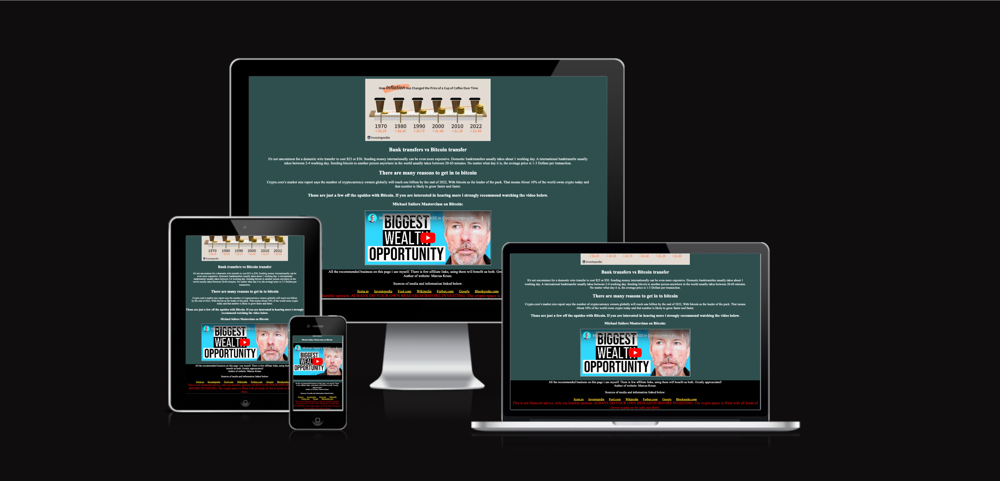
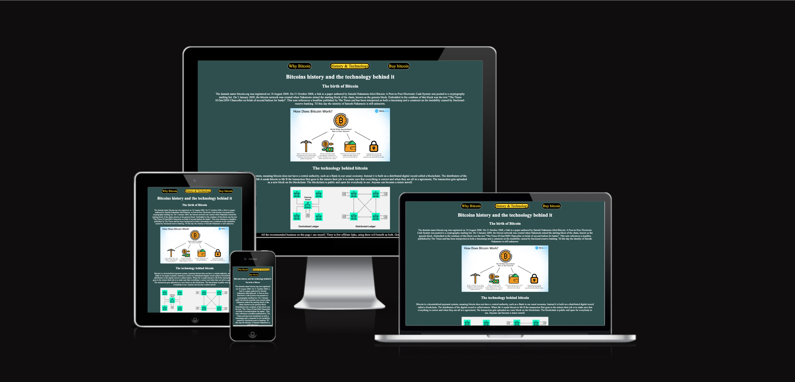

# Bitcoin-Introduction.

## Introduction:
The project is built with HTML & CSS.
It is a website with the title: "Why Bitcoin is the best currency in the world".
This is the website i wish i visited before i bought my first Bitcoin. It would have saved me alot of time and money.
On the three pages there is information in the form off text, images and video. Regarding Bitcoins history, and the technology behind it. Why Bitcoin is good, and finally how to buy and how to store it.

## Purpose:
The website is meant to be informative and helpful for the visitor. This is the website i wish i visited before i bought my first Bitcoin. It would have saved me alot of time and money.
By the links, information and the media provided. The user gets instant access to the golden nuggets i eventually found after alot of trial and error. Also if a visitor was to use one of my links the user gets a little discount and i get a little pay day, WIN/WIN!

## The code:

It is a responsive website customized for all devices. The website looks good while still basic. Colors are choosen to look nice and at the same time give the best possible user experience (while also aluding to the subject). All pages are structured the same way. The images and the video breaks up the text to give the reader a break, while still being informative.

Navbar -> Text Heading -> Text Paragraph -> Media Content -> Text Heading -> Paragraph -> Media Content -> Footer.

## Navbar
located on top of the website. Three anchor tags in an unordered list, Looks like three big buttons, i styled them to be oval and gave them a suiting color. One color as standard another while hovered and a third when selected.
Also changed the size of the font for smaller screen device.

## Video & Images
All off the media on the website is wrapped in a div, in order to make it responsive. There is a set max and minimum width and height and the content is displayed in the center of the browser.

## Affiliate Links 
There is a few affiliate links in the body on one of the pages. colored to be visible but smooth, When hovered the color changes, if they have been visited the color will also change. The links all opens in a new tab. 

## Footer
I changed the footers background color in order for it to be very clear. For a better user experience the font size is smaller for visitors with small screen devices.
The footer contains a paragraph with a personal message from me, and my name as the author of the website.
Underneath i declare the sources i used for both information and media. Each source is made up of an anchor tag that opens in a separate tab there is also a hovering effect on these. and lastly there is a paragraph acting as a disclaimer. I made it red so that its as visible as possible. The disclaimer encourages people to properly do their own research before investing and also warns the user about all the scams in the crypto space.

## Formating, Validating, Testing & Final Photos
The code has been tested by myself using dev tools and also through my mobile.
The code is validated and formated both the css and the html has been approved.

## My personal thaught on the project
Building this website has been both a dream and a nightmare. See i was not aware the projects had a due date.
That is obviously entierly my own fault.

I have been doing my absoulute best to try and catch up. The last ~3 weeks i have been working on this project day and night. There has not been much sleep my life has only revolved around web developement. Besides the stress and lack off sleep it has been amazing. I am so happy i started the course and only wish i did it sooner.

I learned so many things along the way! For example that coding challenges and accually creating a project is two very
different things! Github, Gitpod, visual studio code. Saving repositories, writing commands in the terminal. The list goes on, best of all is i realize that coding is fun, addictive and rewarding.

It will be a pleasure to continue on this path. The course has my full attention and i am doing my best to catch up. I have made so many misstakes its incredible. I dont know if its in the CI material about how to save the repo in github but that has been an issue that is finally resolved. I have redone major parts off the project 3 times. The positive outcome of that is that i have gotten a much deeper understanding off css. Making the youtube video responsive took me ages but it taught me alot more than how to make a video responsive! 

## Resources:
the resources i have used to learn how to code and work with github along the project:

My mentor Seun

https://www.youtube.com/ 

https://www.w3schools.com/

https://codeinstitute.net/global/

Code formated by:
https://www.freeformatter.com/html-formatter.html#before-output

Code validated by:
https://validator.w3.org/#validate_by_input

Googles developer tools has also been a great resource.

## Sources off information and images:

https://blockgeeks.com/

https://www.google.com/search?q=bitcoin+dollar&oq=bitcoin+dollar&aqs=chrome..69i57j0i512l9.2734j1j7&sourceid=chrome&ie=UTF-8"

https://www.forbes.com/advisor/investing/cryptocurrency/what-is-bitcoin/

https://en.wikipedia.org/wiki/Bitcoin

https://www.fool.com/investing/stock-market/market-sectors/financials/cryptocurrency-stocks/benefits-of-cryptocurrency/

https://www.investopedia.com/terms/i/inflation.asp

https://sceta.io/distributed-ledger-technologies/